

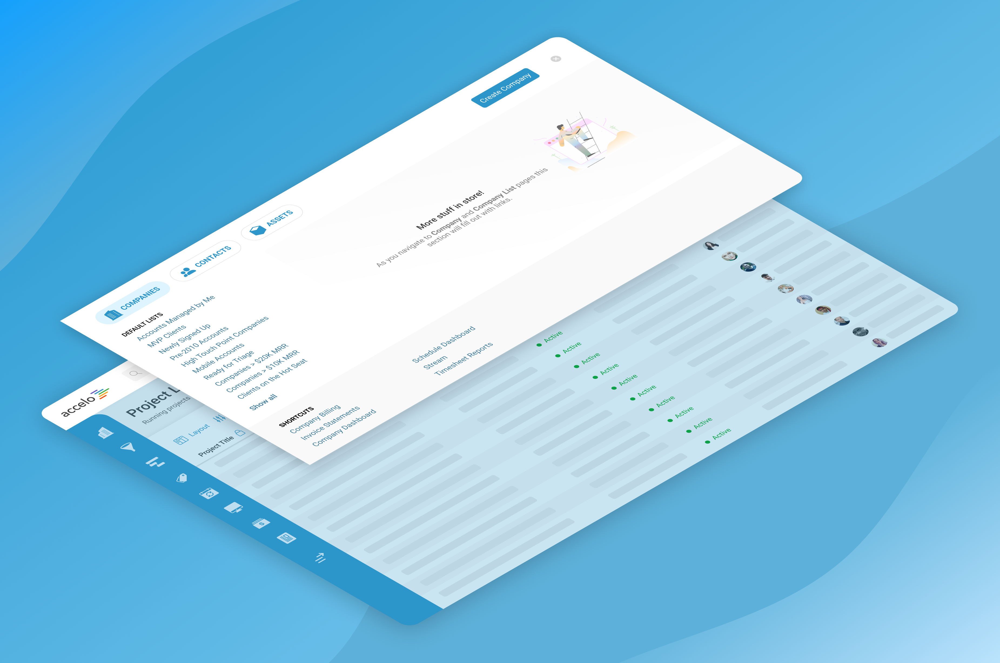

---

    

        

            
Date

            
18-8-2019

        

        

            
Roles

            
UX &amp; UI

        

        

            
Responsibilities

            
User research, interviews, sketches, wireframes, detailed design, prototyping

        

    

---

Accelo is a complex product. Boasting features such as a CRM, time tracking, bulk billing, project management, ticketing, and utilisation analysis, it presents the designer with a challenge when it comes time to curating pathways to specific screens and features throughout the product.

I was tasked with envisaging how navigation could work for Accelo, helping expose and promote core user pathways to support key workflows.

---

Heat Check

## Is Accelo's 2015 Nav Holding Up?
Having been redesigned in 2015, with minimal work being dedicated to it since, the navigation framework in Accelo had become one dimensional and limited by nature

>New modules had been introduced, along with additional pieces of functionality, which had the product looking vastly different to it’s 2015-self. The frame around Accelo was no longer as supportive as it once was.

The product had grown and evolved, as our market and users had changed over time.

---

The Challenge

## Sizing Up the Options
In order to adequately support a new piece of core functionality coming later in 2020, and also solve several user pain points pertaining to the navigation system, the challenge was to design a navigation framework which grouped and categorised related items together via a simpler, more standardized navigational journey, which helps users return to areas of significance faster and with fewer clicks.

---

Objectives

## Prioritising User-Centric Workflows

>With a more standardized navigational experience, users will be able to navigate within Accelo with greater ease and use the system more proficiently to get work done and manage their business/workflows. 

#### Design a new navigational structure that supports Custom Lists
The upcoming Custom Lists product feature will change the way users find and organise work in Accelo. Custom Lists’ core function is the ability to expose large collections of data and allow the user to refine, manipulate, and expose a curated list of objects through the use of advanced filters and custom columns.

>Giving users access to these created Custom Lists via navigation was the main piece of justification for its eventual redesign.

The product team wanted the nav to support a future where users would go about creating/customising their Custom List, then be positioned to access them in frictionless fashion. The new nav had to pave the way for this experience by amalgamating public and private Custom Lists, as well as ones that had been recently viewed and favourited (categorised by their respective module).

#### Improve NPS with increased simplicity and a user-centric nav framework
Quantitative insights revealed that the modern day Accelo user was confused as to what function each nav (top and LHS) served. Other common inquiries were:

* Why is ‘Recently Viewed’ under the ‘Favorites’ menu item?
* What is the difference between ‘Filters’ and ‘Shared Filters’?
* Why does the nav not scale on my small resolution?

Furthermore, the original nav had been designed from the vantage point of how Accelo saw the world - versus a more user-centric approach, backed by UX findings, of how they actually engage with the product. UX efforts were due in order to articulate what users need from Accelo’s nav - and how they go about traversing it’s many screens.

#### Decrease the amount of clicks to see ‘Recently Viewed’ and ‘Favourites’
The placement of an object’s ‘Recently Viewed’ and ‘Favourites’ list in Accelo was an afterthought. The top nav housed a ‘Saved’ menu item which in turn housed a 4-way toggle where such items were located. Not only were these items positioned in a pop out menu that didn’t allow for scaling, but they were unnecessarily detached from a logical grouping with their respective module (each object in Accelo belongs to a parent module).

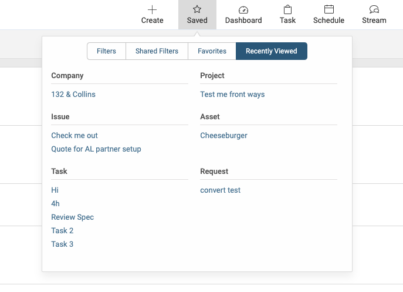

#### Articulate the difference between the top and LHS nav offerings, in a way that users can visually comprehend
The current navigation system offered a LHS panel which was a one-click experience to see all objects pertaining to a specific module. The top nav was simply a collection of drop-down menus that housed links to screens and module-specific areas which could logically be located in a LHS area, however the framework wasn’t built in a way that supports such a notion. For this reason there was a natural disconnect.

The aim of the new nav was to dedicate the LHS area to investigation and data gathering, in a module-centric flow. If the user needed to find a specific project, or retainer, the LHS nav panel would be the place they go. Similarly, for one-off functions - such as timesheets and scheduling pages, which aren’t naturally paired to a module type - the top nav would be suitable (once refactored).

Other areas I wanted to explore:

* Visually refresh the Accelo identity with contemporary navigation patterns, aligning it with the Accelo brand in the process
* Increase the visibility and focus on the global search function (a currently fragmented experience)
* Limit the noise of the top nav and improve information architecture (IA)
Align with long-term product strategy regarding the simplification of Accelo

---

Discovery

## Design Part 1: Exploring a 1-panel nav
After auditing the market and going through some competitive research, the concept of a single-nav framework was appealing. Considering some of the user feedback pieces around feeling ‘overwhelmed’ and ‘lost’, localising the Accelo ‘experience’ into one succinct space held some advantageous facets.

The first concept was more of an extension to the current nav structure, rather than a ground-up redesign. It took the familiarity of the LHS module-centric and expanded its offerings into a second panel with tabs.

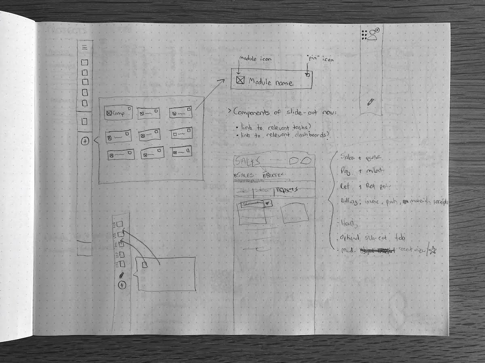
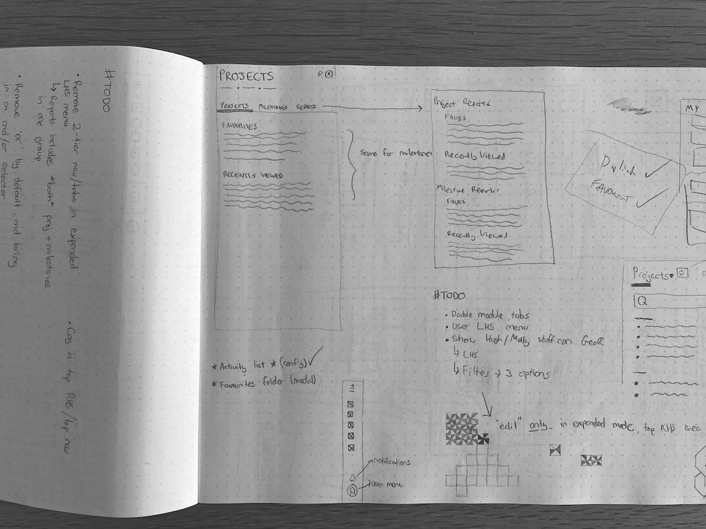
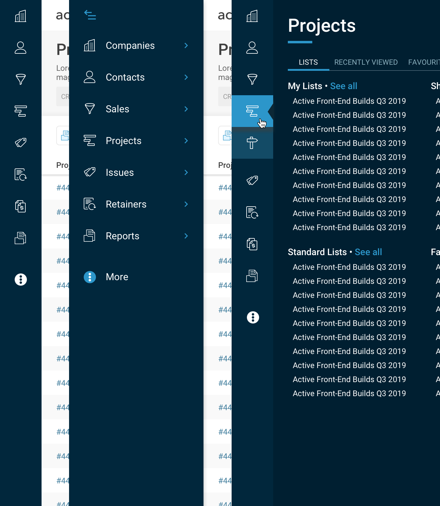

The second concept took some of the learnings of concept 1 and focused on integrating search whilst bringing key features and known user workflows to the forefront; hence the exposure of Inbox, the global create menu, as well as the Tools menu. Module menus expanded into a second and third panel, where tabs were used for housing lists and objects (via ‘Recently Viewed’ and ‘Favorites’). Simple theming was explored as well, to give users a minor yet useful sense of ownership over their deployment’s aesthetic.

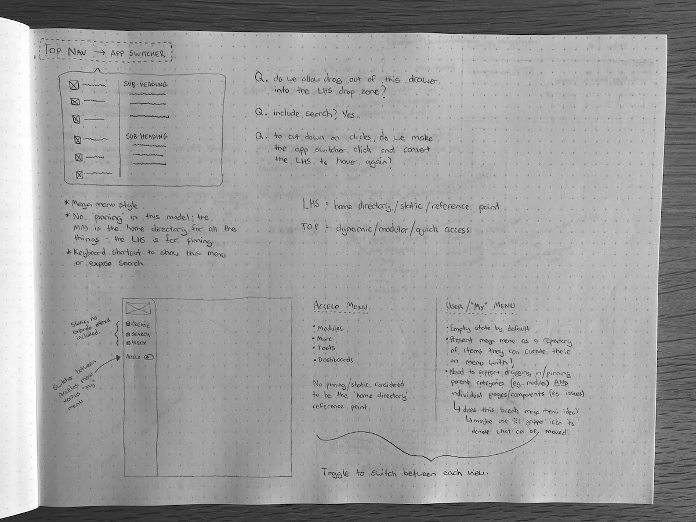
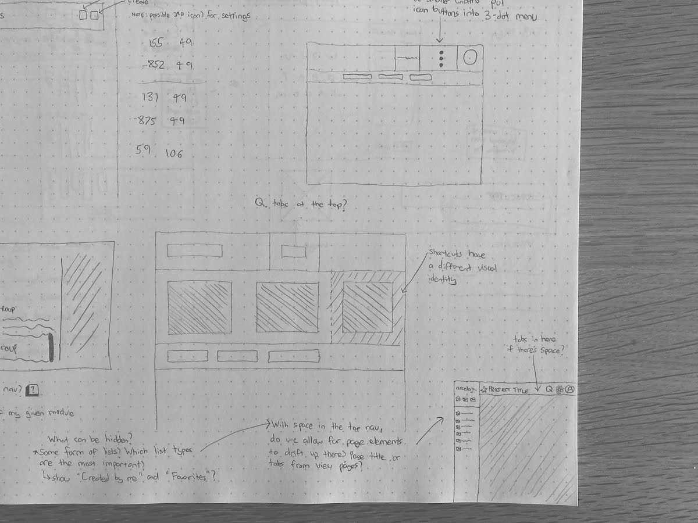
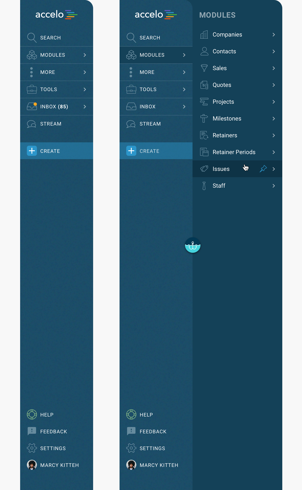
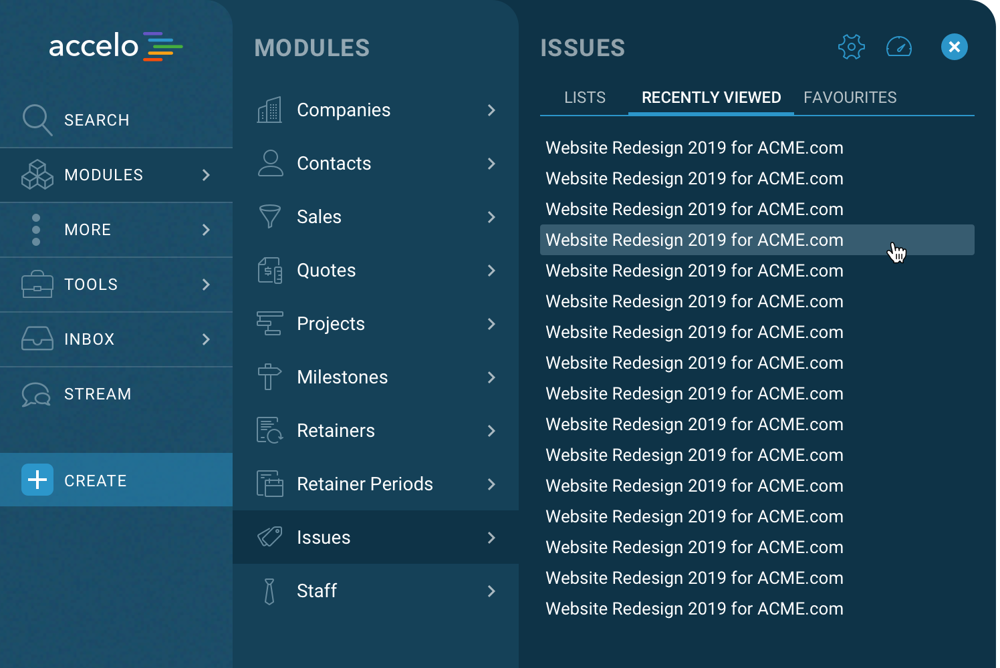

## Design Part 2: Remeasure, Reevaluate, Redesign
Early feedback from user workshops indicated that nav 2, while preferable, felt ‘noisy’ - whereby a hierarchy seemed absent, and certain items without clear ‘parent’ modules seemed lost in menus with arbitrary labels.

With this in mind I started sketching what a new framework could look like if we took the module-centric learnings we had with the first two navs, and combined it with a new and well-thought out top navigation system. A return to the familiar for our users, but with a new sense of focus and efficiency. In this future concept the working rationale was that users needed a clear access point to utility-based, every-day processes (such as dashboards, task boards etc.) as well as a clear path to data-driven discovery practices (accessing a list of projects). The top and LHS nav panels, respectively, seemed like appropriate places to house these ideas.

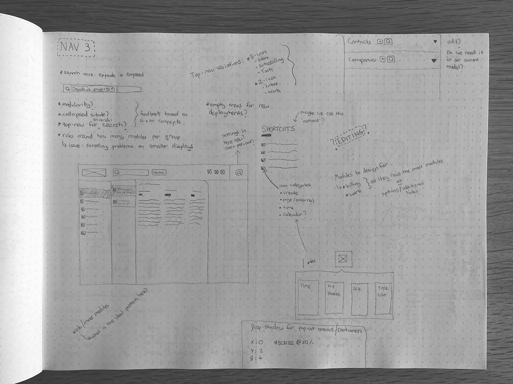

A key element in nav 3 was the module pop out menu, nicknamed the ‘expando’. This would appear on click and house module-centric lists, both public (deployment wide) and private (user made), along with easy access to their recently viewed and favorites. The expando was intentionally made to span a significant width of the viewport, to help focus on the nav process and avoid cramming.

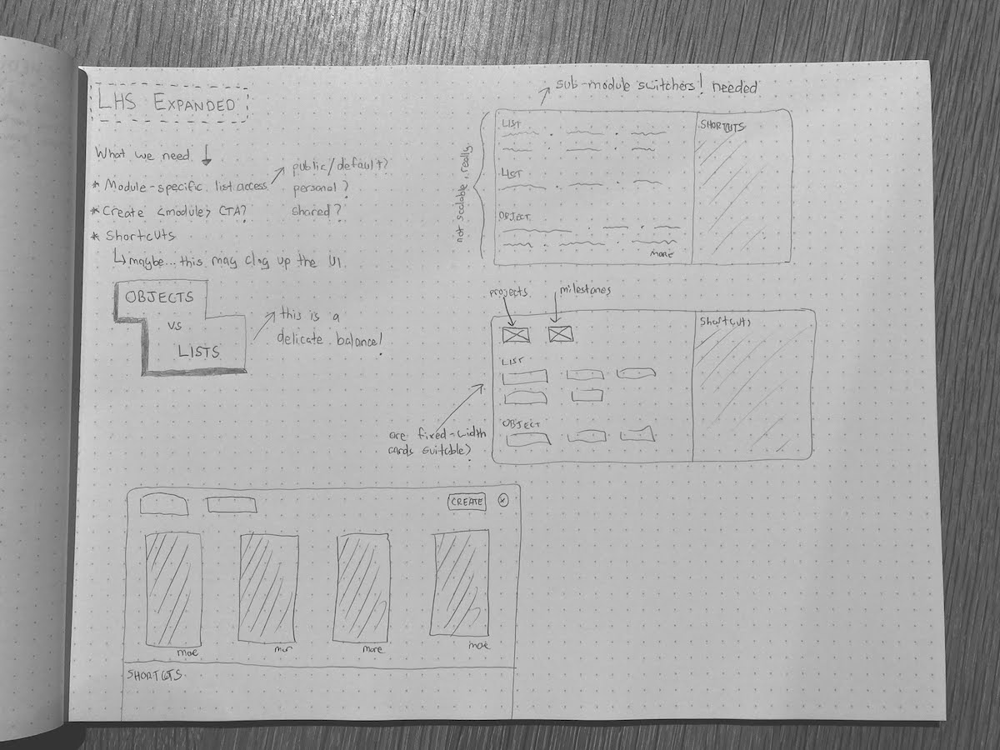

---

What I delivered

## Redesigned Navigation Menus
The top navigation menu was designed in a way that helped users quickly move through work, such as creating objects or logging time, and provided instant-access to action-oriented features like timesheets and the task boards.

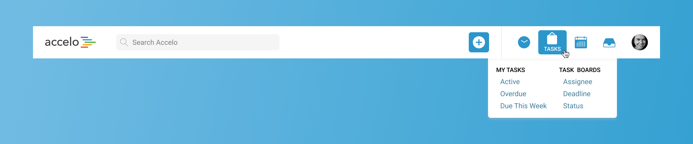

>I paid careful attention to user stories and focused on grouping top-nav items to ensure logical pairing, therefore limiting the size of the top nav and subsequently putting less cognitive load on the user

The left navigation menu was the most significant change from its previous design. Users could still expect to find direct access into Accelo’s modules in this area, but I made additional improvements to help users quickly access the information they care about the most.

## A More Standardised Navigational Journey
In both the top and LHS nav menus, I made very particular decisions about how related objects, screens, and modules are grouped together based on feedback they received from users. One of our top priorities was ensuring that Accelo is as intuitive and easy to use as possible. This newest change helped us achieve this.

    <video width="100%" autoplay loop>
        <source src="/nav_walkthrough.mp4"
                type="video/mp4">
    </video>

Grouping and categorising related items together creates a simpler, more standardised navigational journey that will help users return to areas of significance faster and with fewer clicks! It’s also our way of teaching new Accelo users about the relationships between modules, objects, and screens, so that they come to understand why the product works the way that it does.

## User-Specific Categorisation Within Larger Left Navigation Panels
In addition to the grouping and categorisation of modules and objects in the LHS nav, I introduced larger LHS expanded panels, offering more user-specific power over the objects and screens that Accelo provides direct links to.

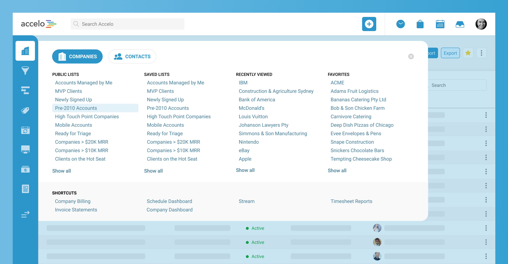

In the LHS panels, Accelo now offers anywhere from 20 to 40 direct links to objects and screens that are specific to each user. For example, instead of clicking through multiple layers to get to the specific projects the user managed, or the clients that they oversee, the user can now get to them directly from our primary navigation.

>I wanted to ensure that our users can get to the items that are important to them today and in the future by surfacing their Recently Viewed Lists and Objects.

The most exciting part about the links inside of these panels is that each user has more power over what is listed there. I wanted to ensure that our users had a way of categorising and easily returning to lists and objects that are always important to them, so I decided to surface ‘Favorites’ in the new LHS nav as well.

## Improved Global Search
The global search functionality was significantly improved so that the journey of searching for and locating items is effortless. We continued to support the keyboard shortcut feature (Alt. + Forwardslash for Chrome or Internet Explorer and Alt + Shift + Forward-slash for Firefox), which allows the user to quickly search within a specific module. Additionally, the global search field was filled in with the module title in view when an expanded panel on the LHS nav is opened (so that if the item you’re trying to navigate to is not featured in that panel, you have one less step to take to search for it).

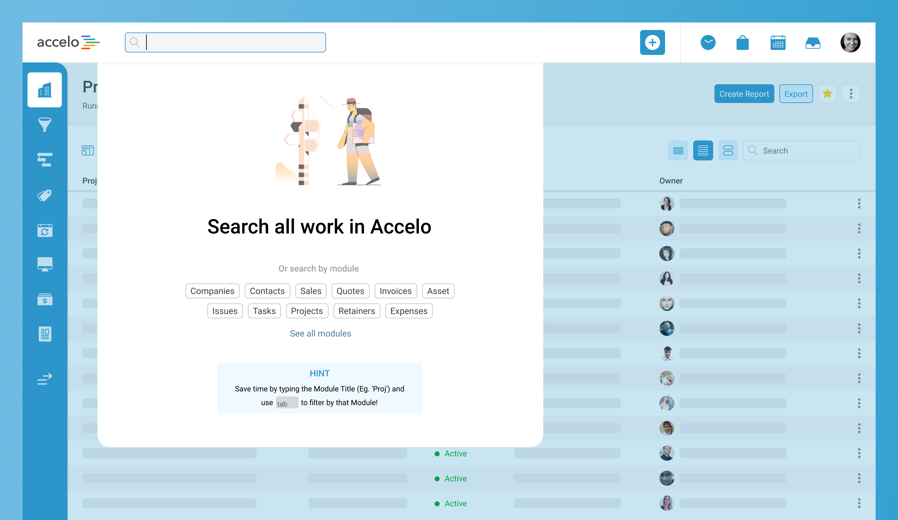

We also expanded the functionality of the global search panel to include a longer list of results in the drop-down menu than previously offered. Now users can find the item they need faster and more efficiently. Module groupings were also brought into the fold, allowing for a higher degree of specificity during the search experience.

---

## Launch, Early Insights & Validating Assumptions
The below quote came from an early beta user of nav 3 - who was able to clearly articulate some of the working rationale I had for the nav 3 concept.

>“We can really see how its been optimised to have all your everyday actions (top right) and more manager type actions on the sidebar making it a lot more user friendly experience - nice work Accelo”

The user retention rate has been extremely positive - with 86% of deployments who opted-in to using the new navigation keeping it switched on. The team also received a high degree of input and ideas thanks to the exposure of the feedback widget located at the bottom of the LHS nav; a small but significant decision which has had a fruitful impact.

### Pivots: Post-Beta changes and considerations
We’ve received some great feedback so far, which has helped us make minor changes here and there to improve the user journey. Some of them include:

* Showing more ‘Recently Viewed’ results when using global search filtered to a specific module. Users really liked this new feature but wanted to see more than 4 results - so this has now been expanded out to 8.
* Allowing for the Stream link to appear in the top nav. This feature received a mixed response, considering the nature of Accelo’s Stream screen and overall uptake. Early user interviews
* Add more

As we look towards the public release of the nav, the design team and I remain vigilant in seeking feedback and ensuring what we deliver is of value to our end users!
