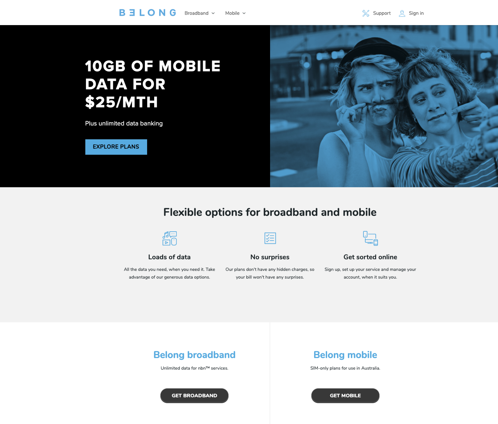
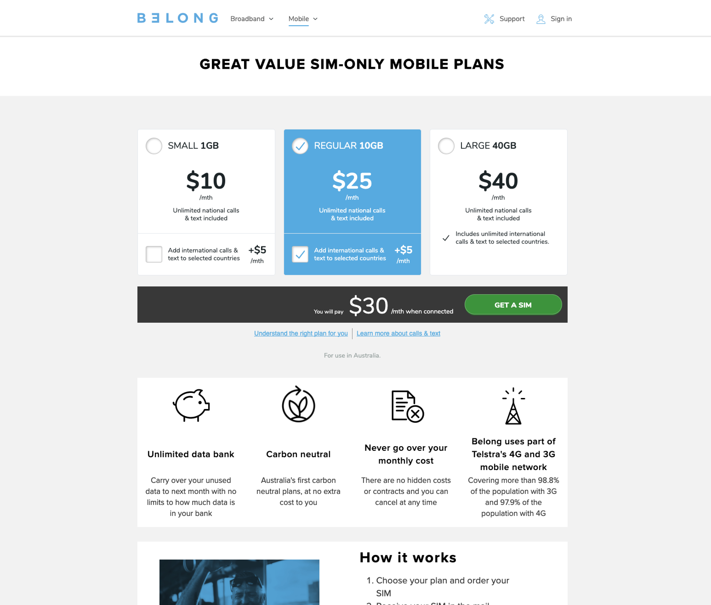
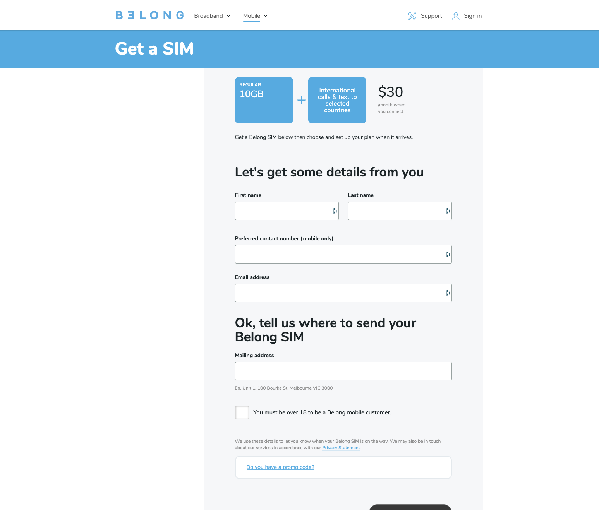
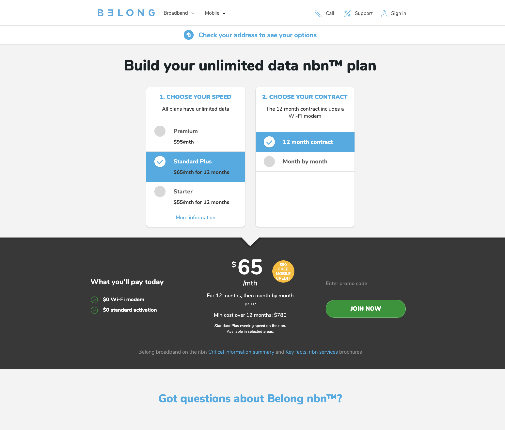
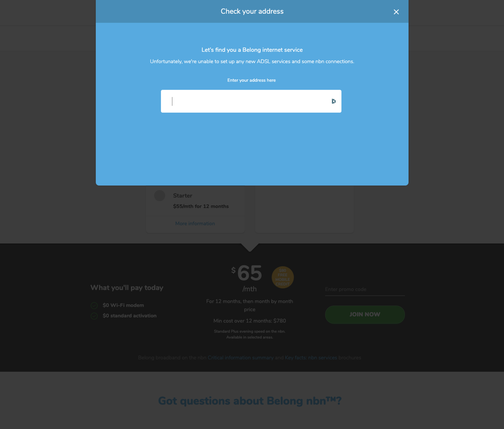
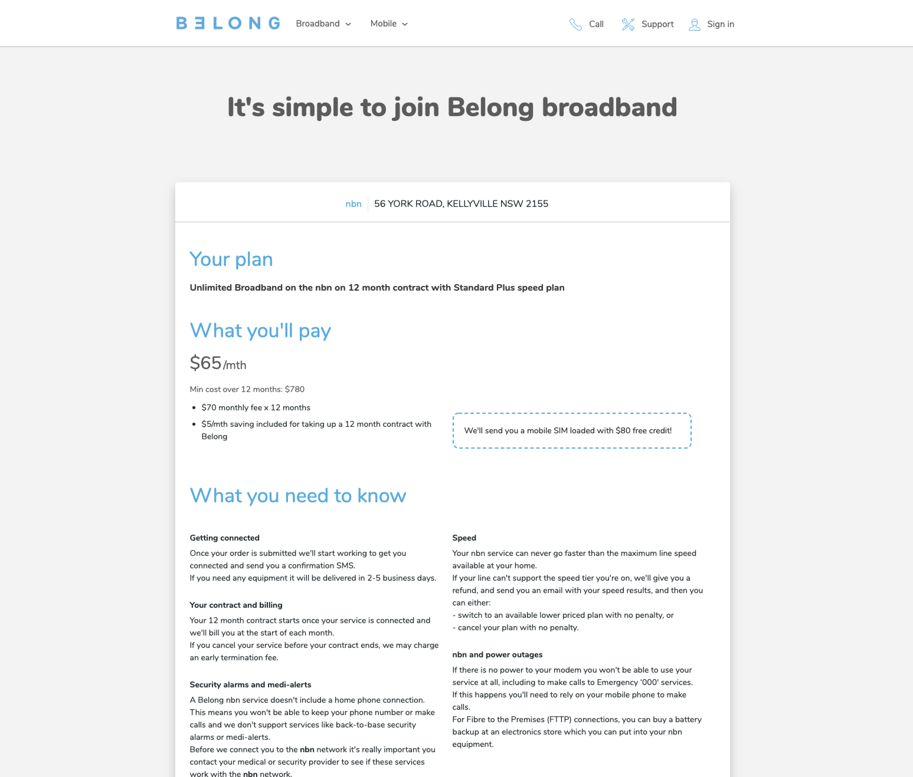

---

    

        

            
Date

            
18-10-2014

        

        

            
Roles

            
UX &amp; UI

        

        

            
Responsibilities

            
Interviews, wireframes, detailed design

        

    

---

Belong launched as a business in 2013 with the purpose of shaking-up the competitive home broadband market by providing Australians with great value ADSL and NBN network services. The product mission was to simplify the process of getting connected to Australia’s internet infrastructure, with no surprises and flexible month by month options for contracting.

## Design Treatment
As per the product mission, the design team and I consulted with business owners of Belong to help create a website that strove for simplicity and low-friction from a sign-up perspective. Costs, T&C’s, and any other ‘fine text’ detail that other ADSL competitors often hid were exposed in the spirit of transparency. This humanistic philosophy trickled down into the design language of Belong’s online presence; simple block colours and flat design elements, juxtaposed with real-life, human imagery to further the brand’s disposition as an internet provider who desired to cut through the industry stigma and care for the end-user.

