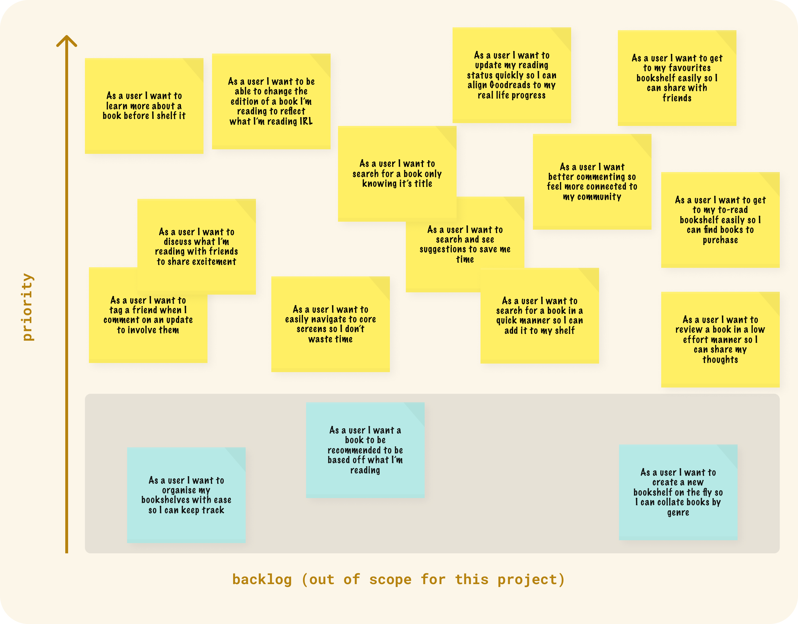

---

    

        

            
Date

            
20-6-2020

        

        

            
Roles

            
UX &amp; UI

        

        

            
Responsibilities

            
User questionnaires, sketches, wireframes, detailed design, prototyping

        

    

---

>“A book, too, can be a star, ‘explosive material, capable of stirring up fresh life endlessly,’ a living fire to lighten the darkness, leading out into the expanding universe.”

- Madeleine L’Engle

## Background
I love reading. It’s a safe place; one where I can let my mind wander in whatever way it wills. I also love sharing the experience of reading with others. Getting excited about a book with a friend, sharing insights, theories, and reflections over a coffee or glass of wine; it is one of the great joys of my life.

For many years Goodreads has been my reading companion app of choice. Despite a scattered few competitors in the market, it remains the primary online platform for book recommendations and social cataloging. The product is a mix of networking, book progressions, recommendation engines, and shelf sorting. The initial offering was launched in 2007 and became acquired by Amazon in 2013.

>Since its acquisition, the product has remained stagnant on several fronts. Core functionality hasn’t adapted with modern web and design standards, and the user experience (UX) is lacking in several key areas. Similarly, the user interface (UI) is outdated and aesthetically bound to yesteryears Web 2.0 design language.

As essentially the ‘only choice’ for reading enthusiasts in the digital space it’s fair to be flabbergasted by i) the fact that a large user base is enduring an otherwise subpar experience, and ii) the reality that no one has come along to disrupt the market.

As both a user of this service, and someone who was looking to add something to their design portfolio, I thought it’d be fun to look at Goodreads from a product design perspective and conduct an unsolicited, conceptual redesign of the iOS app. I’ve never designed a mobile app before, so I was excited at the prospect of giving it a shot.

**Disclaimer**: I am in no way associated with Goodreads or Amazon. As mentioned, this is very much an unsolicited design attempt — one which is conceptual at heart and by no means an exhaustive, end to end product overhaul.

---

## Mission
The mission was initially simple: I wanted to chat with a few friends who use Goodreads, gather some of their pain points (adding my own into the mix), and mock up 2 or 3 screens with a 2020 design mindset.

It played out differently in actuality. My partner (who is an avid reader) runs a casual [book-themed Instagram account](https://www.instagram.com/laura_reads_/), and by proxy is connected with active reading communities from all around the world. It dawned on me that, via her tribe of reading friends, I had access to actual users — people who I’m sure were both on Goodreads and had something to say about it.

>I devised a simple UX survey and asked if she’d post it on her account. A few days later I had 50 responses from users who had graciously shared their reflections.

With the backing of real user reflections and stories, and a product-design focus, the mission became:

* Conceptually redesign some of the core screens of Goodreads
* Implement UX-supported user feedback/stories whilst aligning the design language with modern standards
* Produce basic prototypes in the process

---

## Method
Experimenting with a new visual identity for a product or service is something I love to do, and visual design is definitely one of my favourite parts of my job. However, I wanted to remain disciplined to a more traditional product design approach to ensure my own biases weren’t unnecessarily guiding my design efforts. Hearing about how other users engage with the product, in ways I don’t, gave me a much more holistic view of the service Goodreads offers, and therefore informed what I chose to dedicate efforts towards for the redesign initiative.

As part of the discipline piece I reflected on several pitfalls I wanted to avoid:

* Conceptualising a design that completely disregards current branding
* Being too aesthetically minded and superficial (allowing usability to suffer)
* Designing without scalability in mind

The ethos of these points can be summed up, succinctly, by a phrase coined by Paul Adams, VP of Intercom, known as [“The Dribbblisation of Design”](https://medium.com/intercom-inside/the-dribbblisation-of-design-406422ccb026) - a style of visual design output aimed at appeasing and gathering social capital from the aesthetically minded communities of dribbble.com, versus solving real-world, real-product business problem. Gathering real user feedback for this project was already one large step away from this practice, and I’m again tremendously grateful for the folks who helped me out in that space.

---

## User Experience (UX)

### Understand
Abraham Lincoln was once quoted as saying “Give me six hours to chop down a tree and I will spend the first four sharpening the axe”. Similarly with digital product design, in the UX phase, we feel obligated to serve the user and ensure we know what the problem is before we go about solving it.

Through my humble yet insightful Google Forms (like I said — it’s a small side project!) UX survey I was able to ascertain several high-level, key pain points users were experiencing.

### Research
If this was an entire product overhaul I’d be looking to do a lot more than a UX survey as the core piece of the UX phase, however the scale and nature of this initiative called for something smaller and quicker so I could finish the project in the foreseeable future.

The UX survey was divided into 4 main sections:

    <dt>General Usage</dt>
    <dd>
        
These questions were designed for gathering insights on things such as the amount of time the user had been on the platform, how often they engage with the service, and what screens/functions they use most frequently.

    </dd>
    <dt>Community</dt>
    <dd>
        
These questions were designed for gathering insights on how socially interactive users were, and how their behaviour around engaging with other users shaped their sense of connection with friends and authors.

    </dd>
    <dt>Experience</dt>
    <dd>
        
These questions were designed for gathering insights on smaller, micro-behaviours such as the tendency of a user to leave a star rating and how they use the search function.

    </dd>
    <dt>Design</dt>
    <dd>
        
These questions were designed for gathering insights on how the user viewed the aesthetic nature of Gooodreads and how they engaged with the different design languages between the desktop and app.

    </dd>

### Define
The define phase of this project involved collecting data from the initial research phase, collating insights, and synthesising these data points into a meaningful and usable body of knowledge — represented in the form of pain points, user stories, and personas.

Some of the high-level pain points to come out of the survey included:

#### Search functionality is limited
Searching in Goodreads is one of the main user interactions reported back from the UX survey. Feedback ranged from minor annoyances with random books appearing when they shouldn’t be, to passionate reflections on the absurdity of not being able to see search results unless the book was spelt correctly (i.e. no prediction technology)

“It’s terrible! I don’t understand how a search engine owned by Amazon could be so clunky and get a book wrong if there’s a slight error in it”

“A book will appear in the search but when you go to select it, the search ‘catches up’ with the extra letters you typed and will change the selection a split second before you tap it”

“It’s awful. Doesn’t predict what I’m searching well based on book popularity or publication date and doesn’t suggest helpful alternatives if I’ve mistyped one word!”

#### A significant disconnect from friends and authors, despite the platform identifying as a social networking service.
Users reported feelings of disconnection between themselves and friends on the platform. A lack of commenting technology standards (for 2020) such as tagging, replying, and reacting is hurting the platform here.

“I’d be a lot more interested in talking to people on Goodreads if I could reply to someone’s comment!”

“I like how other social platforms allow you to tag someone. I wish Goodreads had that!”

“Notifications on the app suck, and people never see when I’ve commented on something - so maybe if that was fixed I’d be more inclined to chat more”

#### Navigation is confusing
The Goodreads service runs surprisingly deep from a desktop site offerings perspective, so naturally there’s a process of elimination involved in presenting a consumable set of navigational options in an app environment with less screen estate. Users stated that finding their way around the Goodreads app was difficult, and that some of their more frequently used screens/functions weren’t readily accessible.

“It’s clunky, the navigation is not easy to work out and often it is hard to get back to the page you were previously on”

“It’s not user friendly and doesn’t respond well to what would seem like basic prompts by the user.”

“Even though I’ve used it for a long time, it still takes me a few goes occasionally to get to the right page to update my reading status”

#### Aesthetic is dull and uninspiring
Users in 2020 have high expectations of apps, and there’s only so much they’ll put up with when it comes to something which looks (and acts) outdated. Users shared reflections pertaining to a cluttered UI - something that looks severely outdated, and isn’t a delight to use/look at.

“It’s outdated and clunky and definitely needs a complete overhaul”

“It is so average! For such an incredible resource and concept the delivery is so flat. It makes me feel like I am living in the prehistoric times, especially when things like Bookstagram and blog posts etc have come a long way!”

“I like the simplistic branding, it would be nice if the site looked more modern. I find it a bit too clustered and slightly old fashioned.”

#### Mobile app is missing some functions that the desktop site offers
As mentioned in the navigation pain point, there are several pieces of functionality missing from the app experience which would enhance user workflows. Users shared comments around an inability to find their friends list, the restriction around changing editions of the books they’re reading, and the absence of notifications on a mobile OS level.

"It has some stuff I make use of frequently; such as changing book types (hardcover/softcover and therefore page numbers) which I'd LOVE to see on the app one day."

The app is slightly cleaner than the desktop website, although I hate that I can't change the version of the book I'm reading on the app (I have to use desktop for that)"

"I like to use the mobile/app version only because it is more convenient. The web version is more functional by far."

### Needs
Based on the above findings I ascertained that the following could be considered as user needs, which in due course would influence the design:

    <dt>The ability to search in a way that serves the multifaceted nature of looking for a book</dt>
    <dd>
        
The limitation Goodreads currently places on searching seems nonsensical. Book titles need to be entered with zero grammatical errors in order to be returned form the back-end (similarly with author names). A lack of specificity isn’t catered for, which is in stark contrast with the Google way of viewing the search experience (key words, sensible predictions etc.)

    </dd>
    <dt>The ability to make reading progress updates quickly, and to limit the friction of reviewing a book</dt>
    <dd>
        
Updating reading progress is a core user behaviour. Sometimes done on a daily basis, the action needs to be readily accessible and fluent; able to be engaged with in a swift but meaningful way.

    </dd>
    <dt>The ability to engage with friends in a way that promotes fun, social interactions</dt>
    <dd>
        
Despite identifying with being a social network, there’s a severe lack of social interaction on Goodreads.

    </dd>

### Main focus
* Making the stream the centrepiece of discovery and social activity via improvements to commenting, and introducing emotes and badges for gamification/fun factor
* Making updates and reviews a quick and delightful experience
* Making search sensible
* Exploring new opportunities such as lists to go beyond simple book cataloguing

### User stories and personas
User Stories were formed to translate a lot of the UX survey findings into smaller chunks of requirement ideas. Several were backlogged, despite being great ideas, as they fell slightly outside of this conceptual redesign.

Three personas were formed based off demographic insights from the UX survey, as well as other insights. They represent the power, casual, and new reader user type. It’s useful to refer back to personas as the detailed design phase plays out and evolves.

### Sketching
Sketching took place to get ideas and concepts out of my head and onto paper. Before attempting some basic wireframes several iterations of functions, user flows, and functionality pieces were drawn up, erased, manipulated, and re-drawn. This is a common stage for any designer before entertaining more technical limitations of a project.

### Wireframes
After sketching reached a point where I felt confident with some ideas, I jumped into Adobe XD (I often used Whimsical or Axure for such purposes, but there was a spirit of experimentation in this project — so I tried something different) and explored some more comprehensive layouts.

---

## User Interface (UI)
The UI detailed design phase brought everything together. To pickup on a note I made right at the beginning, this is a conceptual redesign attempt. Not all corners of this app have been explored. One day I hope to but, for now, say hello to some Goodreads screens after some design treatment.

### Home (Stream/Feed)

#### Cards
Cards have been simplified. The removal of the current ‘Add to shelf’ call to action (CTA) button gives the book cover art space to breathe, and becomes the main focus of attention along with the book title.

Users need more context before they choose to add a book to the ‘To read’ list (or another shelf). To nudge this behaviour the card has been designed to encourage tapping, which brings up a bottom sheet. From here the books synopsis is exposed, as well as two actions: ‘Read more’ or ‘Add to shelf’.

Comments are now hidden by default, until the user wishes to engage with them. This allows the stream to house more cards and keep the users attention on consuming updates from their book community. It also allows the comment experience to be more concentrated.

#### Comments
Comments have their own bottom sheet to curate a more immersive social experience. Users have more screen estate to see more discussion, and the new ‘Reply’ functionality allows for more direct communication between specific comments. Tagging has also been introduced.

#### Emotes
The ability to ‘react’ to a general activity update has been introduced. This was brought in to promote more social interaction.

>One of the main focus points of this redesign was to convey a greater relational proximity between users and their friends. Giving users the ability to express themselves in playful ways helps this cause, and ideally encourages book-related frivolity.

#### Badges
Simple badges have been designed to help bring a small sense of gamification to the app experience. Collecting badges is a simple but fun way to celebrate user behaviour from a reading perspective, and generate excitement. It also adds a fun component to the users profile screen.

### Updates
Updates have been designed for rapid interaction. Via a bottom sheet, the user can swipe through books they’re currently reading, tap an input to update what page they’re up to, and move on. If they choose to tap the ‘I’m finished’ CTA, they’re navigated to the review flow.

### Reviewing

#### Stars
The vast majority of users reported that they submitted star ratings when they finished a book.

>A key frustration was the inability to give half-star ratings, though. This design takes such feedback into account, and allows for 1/2 star increments via a simple slider.

#### Review comment vs thumbs up/down
This was one of the more peculiar UX insights. A significant number of users said that star ratings and reviews on books serve as a major influence on their decision to read a book. Yet, only a small number of them indicated that they themselves leave comments as part of their reviewing process (the more common user flow was to leave a star rating and submit). To promote buy-in to the review economy, I explored an alternative way of leaving a review comment, in the form of simple ‘thumbs up’ and ‘thumbs down’ comments. Should the user wish to share a thought on something they liked, instead of bothering with a fully formed string of sentences, they can do so via this new method.

### Search
Keyword driven search is something users of the internet in 2020 are accustomed to. The reality that Goodreads rewards specificity, exclusively, seems like a backwards step in comparison to modern web standards. By employing a more familiar keyword driven search framework, including immediate callbacks to the back-end and appropriate predictions, this design showcases what search could be, at a conceptual level, inside the Goodreads experience.

### Shelf (My Books)
Users reported that using/viewing custom bookshelves, especially the in-built ‘Want to read’ shelf, was a persistent part for their workflow. The ‘Shelf’ screen has been redesigned to give visual prominence to both the ‘Want to read’ and ‘Favourites’ shelves. For user-created shelves a tabbed-based component has been used to allow for quick switching between them.

### My Account/Notifications

#### Account
The Account panel follows a similar framework notion to the individual book sheet, whereby a pop out menu is deployed for quick reference and quick dismissal to avoid unnecessary interruption to the user flow.

#### Notifications
Notifications are situated inside the ‘Profile’ pop out menu. Restrictions in the information architecture (IA) of the bottom nav meant something has to be amalgamated, so as to avoid having excessive icons along the bottom of the app. Notifications are displayed as minimal cards, sorted by default from newest to oldest, with ‘unseen’ notifications employing a slightly off-white background. Notifications are able to be cleared via a simple ‘Clear’ link. Tapping notification takes the user to the appropriate page/sheet for further engagement.

### Individual Book (sheet/screen)

#### Sheets
Clicking on a book cover from anywhere in the app exposes a bottom sheet, where contextual information about the book is exposed. The decision to use a sheet was to help avoid interrupting the user flow in an invasive way. Enabling the user to read more or simply collapse the sheet and move on was the main desire here.

#### Tabs
Swiping from left to right on the individual book screen allows the user to consume a wider amount of information pertaining to a book.

Review cards are shown, by default, from newest to oldest. Users are able to comment or react to individual reviews. Filtering options give the end user the ability to show reviews with specific star ratings along with other additional options.

The inability to change the edition of a book via the app was a major pain point for users. This design considers the desire for this workflow and therefore lists all the editions of a book via the ‘Editions’ tab, with the ability to filter by type (soft cover, hard cover, Kindle etc).

### List
Lists is a new feature I’m proposing in this redesign in order to i) expand the realm of activity on the platform beyond simply starting, stopping, or reviewing a book, and ii) to increase the rate of in-bound traffic to the platform by encouraging users to employ the sharing functionality on the list page.

>Lists are a simple, easily digestible way to share information and help communities of niche interests to further their reach by curating offerings for interested parties.

This is a feature I’d imagine authors would like to explore, as well.

### Profiles
The profile screen has been designed in a way that showcases more meaningful information about the user on first view. Books they’re currently reading and their reading challenge for the year (something nearly all users reported as engaging with) takes the limelight, afterwich custom shelves are listed.

Badges and lists that the user has created also feature on the profile screen.

Connected social accounts are also shown, allowing users to connect with each other on alternative platforms.

A clear ‘Add friend’ icon button is featured in the top left of the screen. Should the user already be connected, this will be converted to a ‘Message’ icon button (although it should be noted that nearly all survey respondents stated they they don’t use the inbox feature on Goodreads — so this would be need to be thought out a bit more.)

### Reading Challenge
The yearly reading challenge screen has only received minimal aesthetic change. Users reported that one of the main reasons they used the reading challenge was for a more presentable list of books they’ve read that year. For this reason books on this screen forgo the horizontal scroll style seen on other screens and instead follow a traditional grid pattern — allowing for quick consumption.

---

## Reflections
This was an enriching experience. Having never done mobile app design before it really pushed me to think about the intricacies, limitations, and opportunities of cross-platform design.

>As I audited the desktop ‘full’ experience of Goodreads I felt challenged, on numerous occasions, to hold up the value proposition of feature x versus feature y — considering the restrictions, both from a screen estate and functionality perspective, of mobile design.

The UX survey assisted me greatly in this space, and definitely helped clarify my own observations.

There are all sorts of areas of the Goodreads app not included in this design study. At some stage I’d like to explore:

* How **browsing** the vast catalogue of Goodreads works, seamlessly, in this new framework
* The **create flows** for custom shelves and lists
* The **author pages** (the foundations of this page were possibly covered when I designed the individual user profile page - however I say this without having exercised deep thought to how author pages may
* How a **simple online shopping integration** might work for independent book stores - whereby users could see where a book is available within close geographical proximity
* **Highlights** (I feel as though these are undervalued with the current app offering - so there's an opportunity here)
* Many other features I thought of during this process during "aha!" moments but have since escaped my mind!

Outside the realm of the app, I used **Framer** as my prototyping tool of choice. I came to understand that it’s an extremely deep tool, rich with features which I’d like to explore in the future so I can make more comprehensive prototypes.

At a later stage I'd love to explore the Android app, as well as the desktop site, for conceptual redesigns.

As with nearly every design I do, I can't help but look back and wonder how things would have looked if I pivoted here, and nudged there. This was the final of three concepts I put together, and if I didn't stop I'm sure I could have designed several more - each exploring a different aesthetic tone and purpose. For now, though, I consider this concept to strike a nice balance between functional and modern.

I hope you do, too 😊