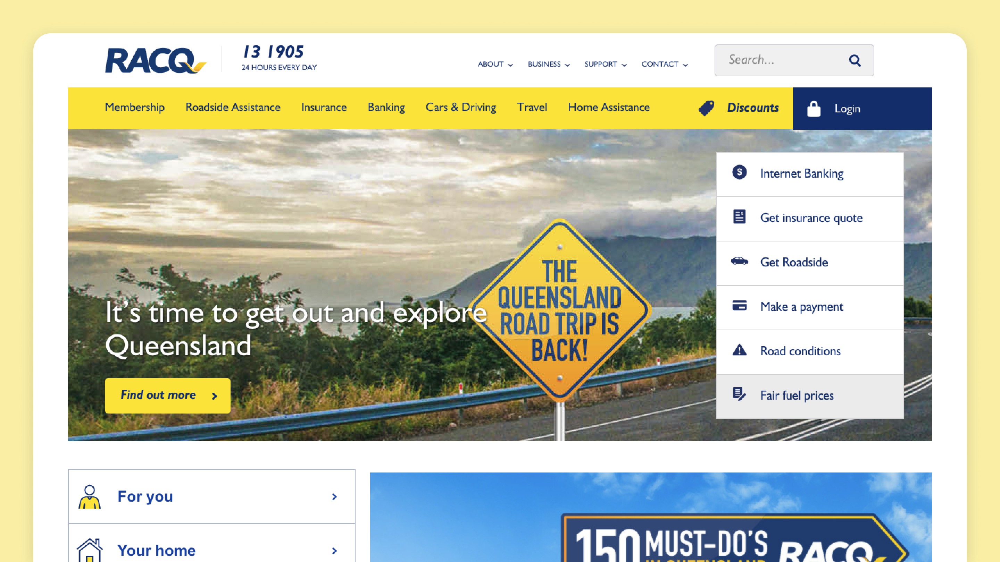
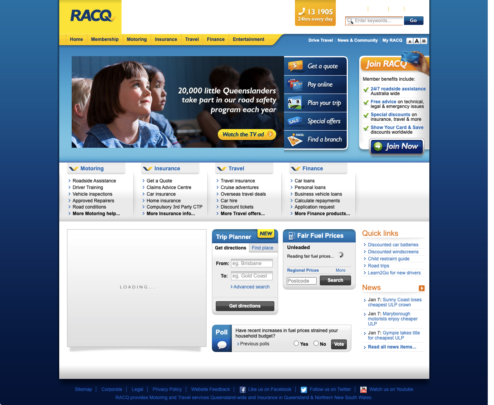
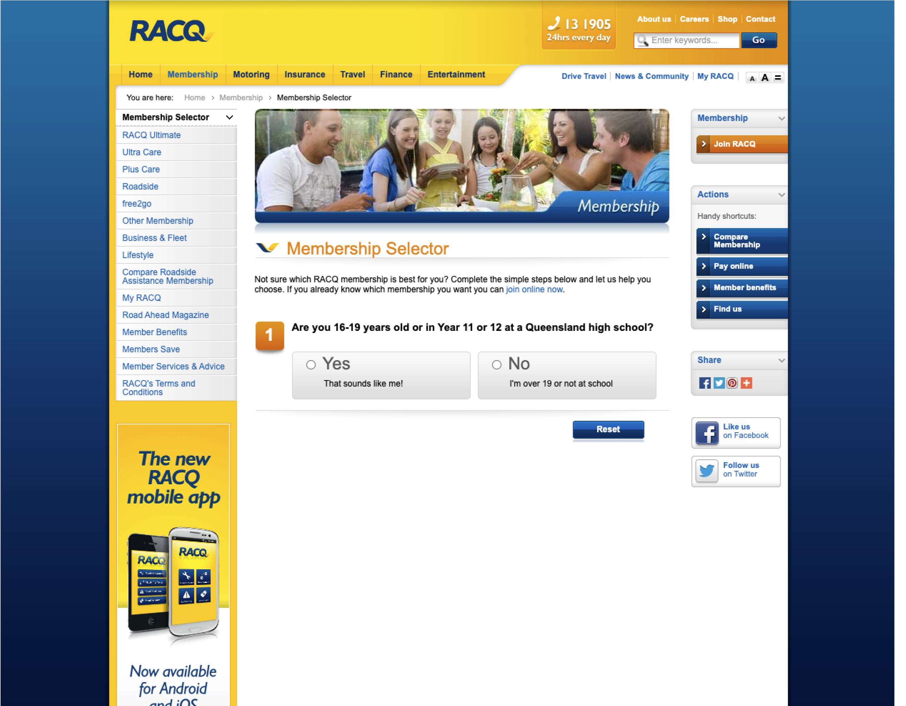
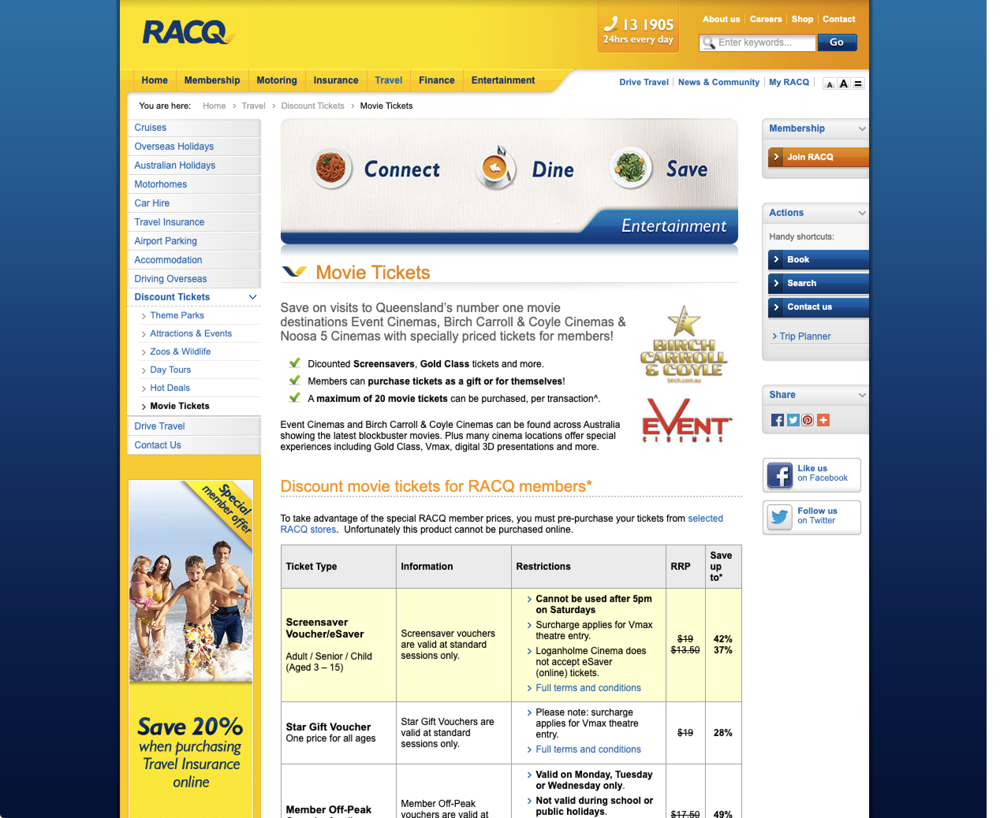
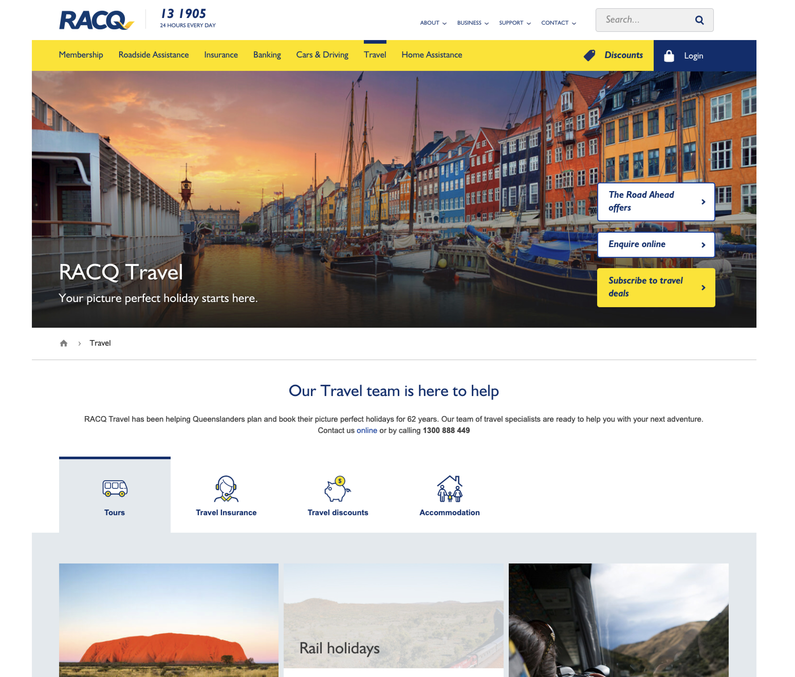
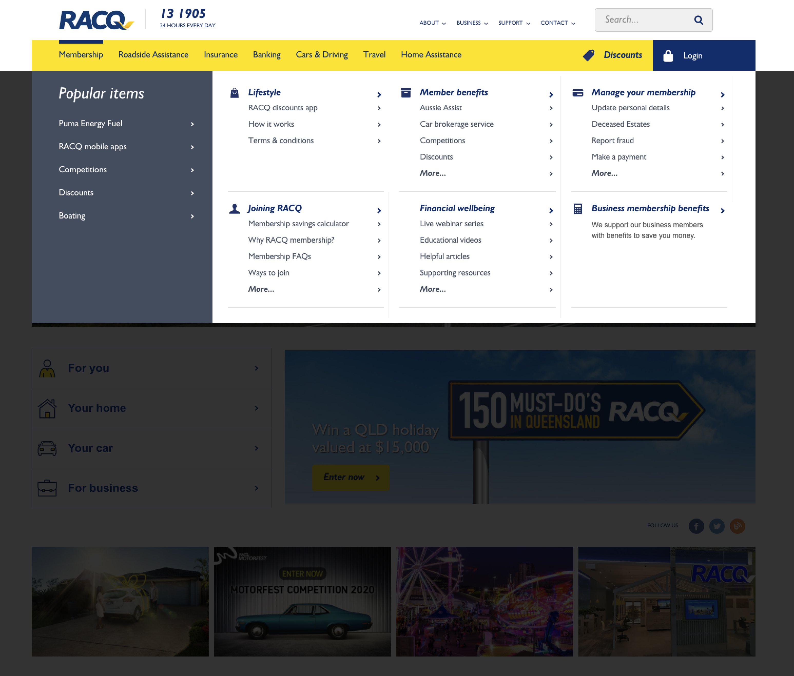
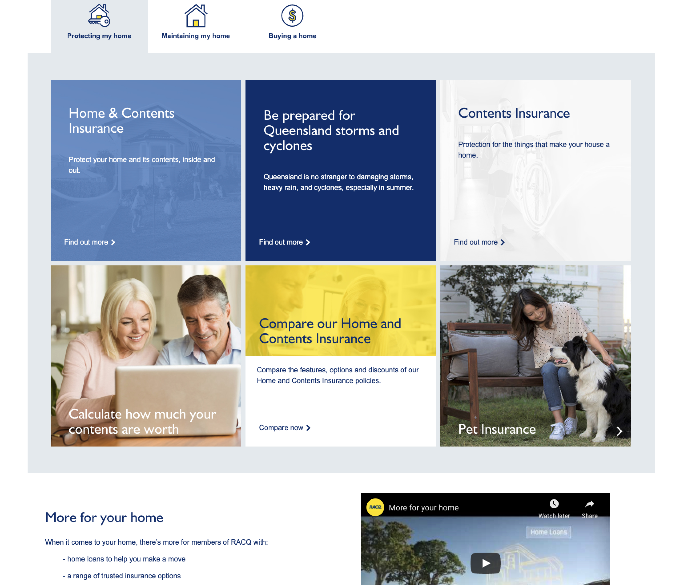
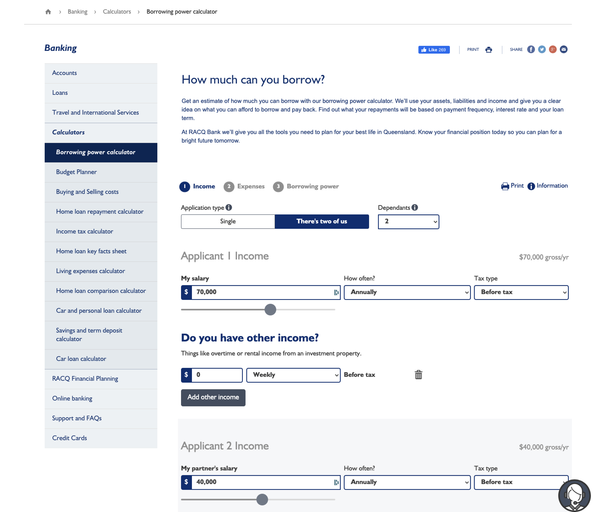
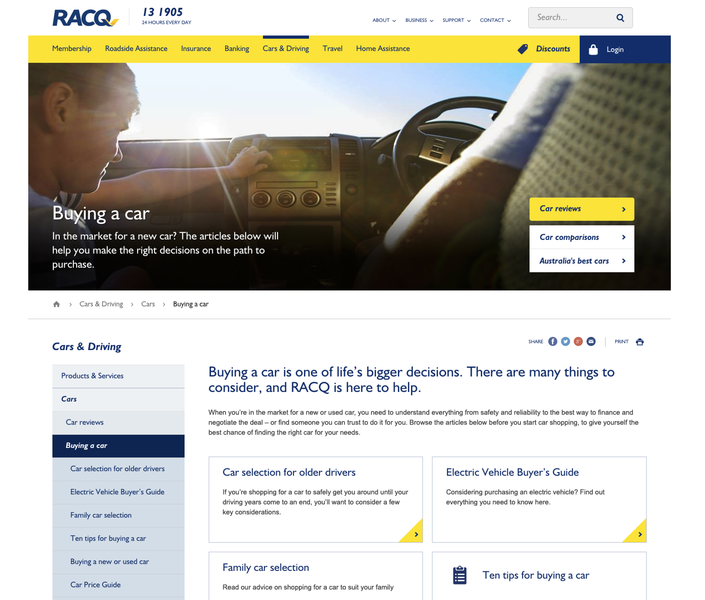
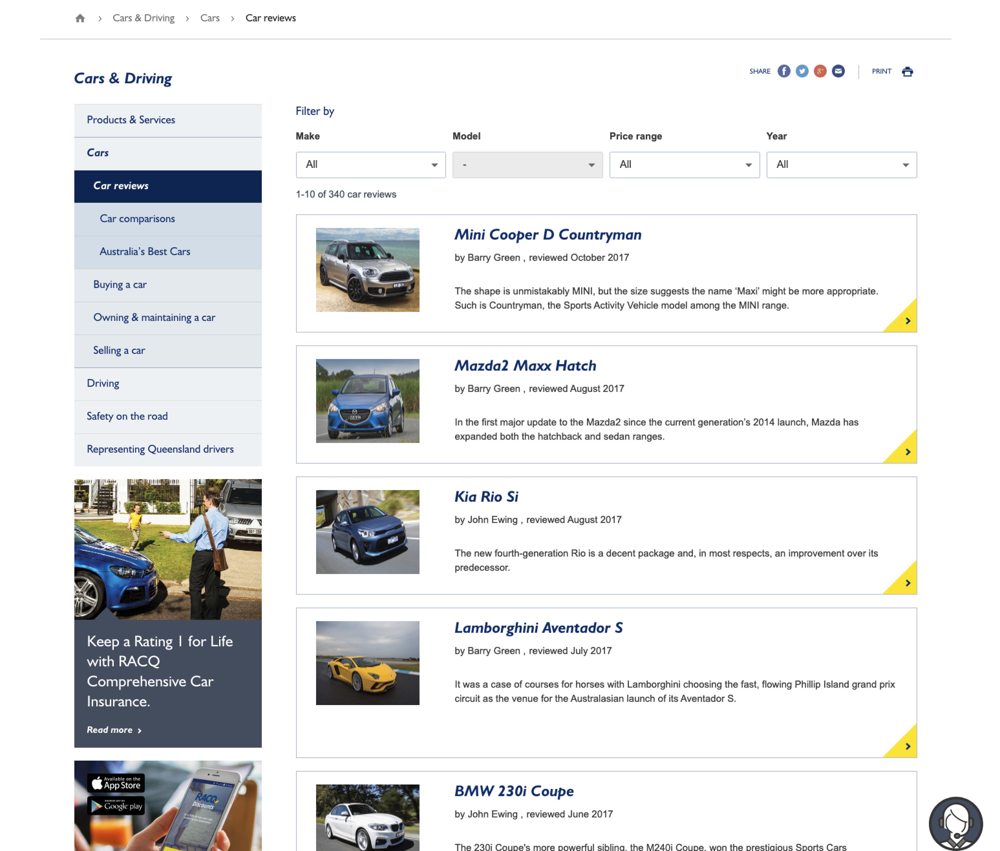

---

    

        

            
Date

            
5-7-2014

        

        

            
Roles

            
UX &amp; UI

        

        

            
Responsibilities

            
Business owner interviews, wireframes, detailed design

        

    

---

Initially a club for automobile enthusiasts, RACQ grew over it’s 100-year life into Australia’s largest membership club; ranging from offerings such as roadside assistance and car reviews, to diversified offerings such as insurance, travel programs, and banking.

RACQ’s digital presence was deep but outdated. Covering 30 business units, the public facing websites IA was convoluted and many UX stories pertaining to confusion, a lack of reference point, and buggy functionality, had found it’s way to business owners. RACQ engaged with Deloitte Digital to conduct a complete redesign.

---

## Digital offerings prior to redesign
RACQ’s brand was bold, with the iconic yellow and blue logo Queesland had grown to know over the decades. The website at the time sought to hold these two in contrast but at the cost of visual decipherability.

---

## Design Treatment
Initially a multitude of UX customer workshops were conducted. The UX team would meet with business unit managers/owners to discuss at a high level their main objectives, for their respective department, for the RACQ website. These were held in contrast with insights gathered from end-user workshops - visitors and members of the RACQ membership program who frequented the website to check membership perks, register cars and insurance processes, and other things.

One of the biggest challenges of the design process was the sheer size of the website. The client maintained that each business unit be issued a fair share, screen estate wise, of the website. As a design team we needed to balance this request whilst improving the overall UX and ensuring the cognitive load isn’t too high for the end user. Particular care was given to the mega menu; the main pattern issued to help us present the user with the plethora of pathways on RACQ.com.au.

The brand identity was honored during the detailed design phase. RACQ’s bright yellow was selected as the main colour for primary CTA elements, with the navy blue (and other blue variants based off this HEX code) serving as the link and label colour throughout. Whites and greys were introduce to help bring about a sense of space amidst a UI with a lot going on amongst it.

